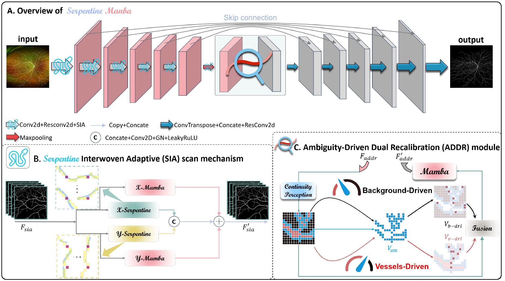
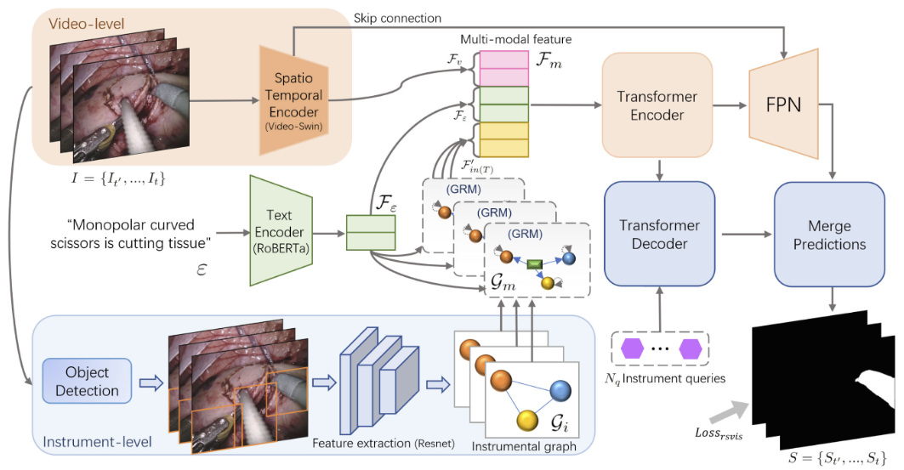
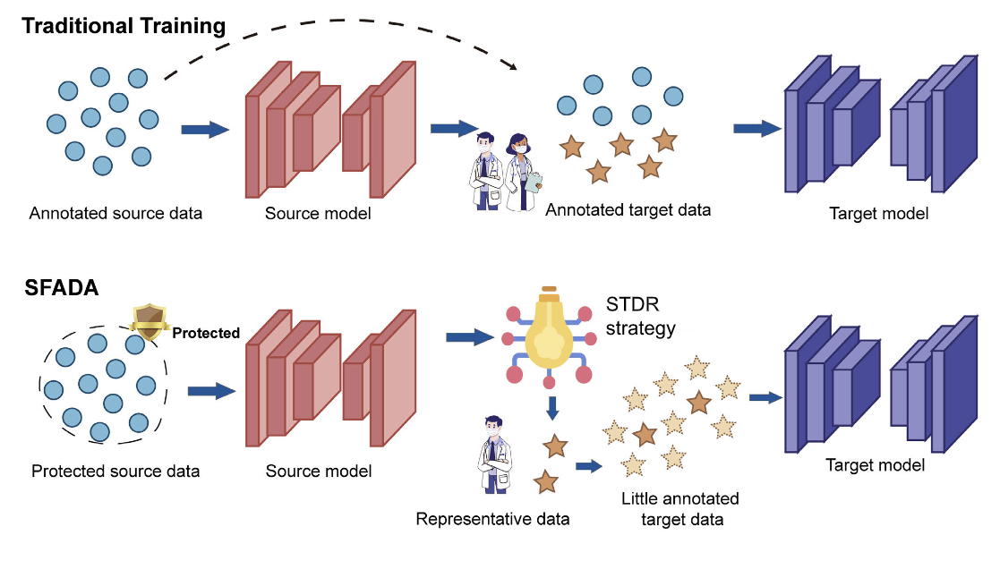
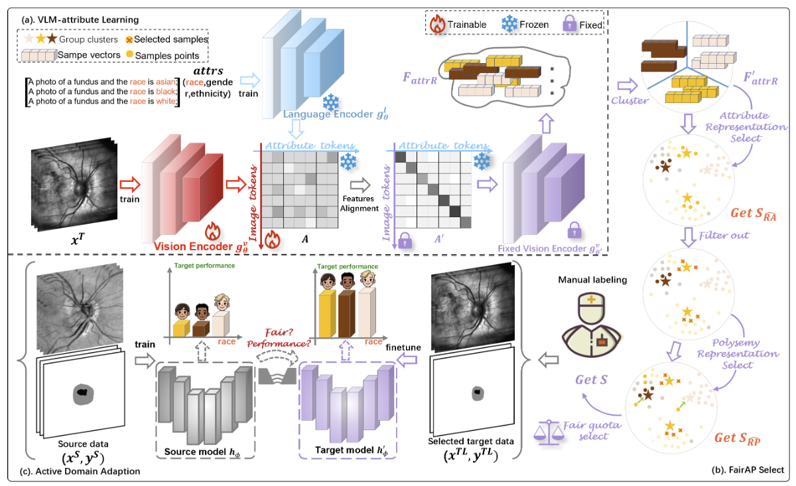
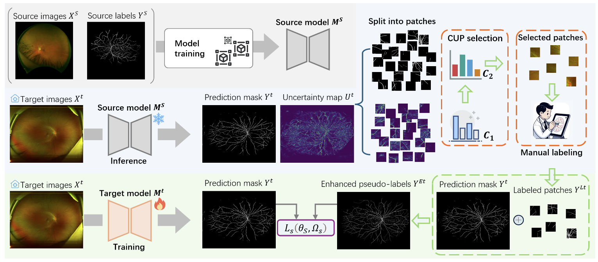
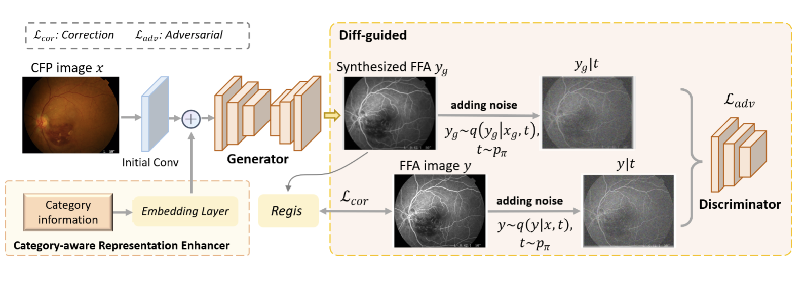
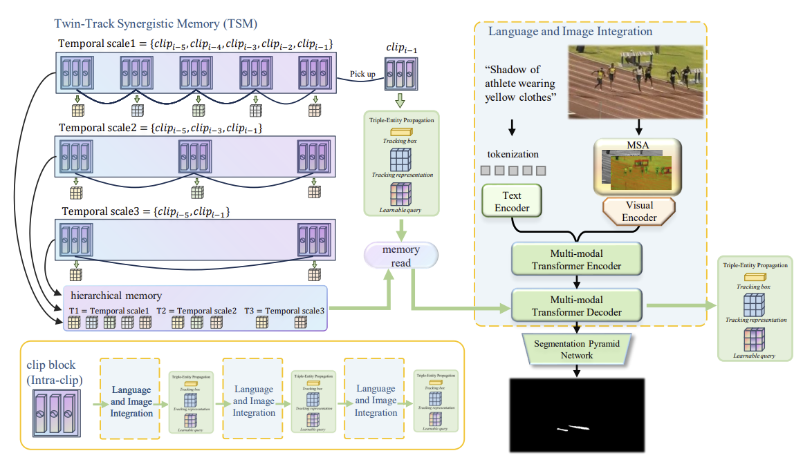

* Equal contribution, # Corresponding author

<b>Journal<b>

  <table style="border-collapse: collapse; border: none;">

  <tr><td width="300" style="border: none;">
  

  </td>
  <td style="border: none;">
  

    
<b>Serp-Mamba: Advancing High-Resolution Retinal Vessel Segmentation with Selective State-Space Model</b>

    
<b>Hongqiu Wang</b>, Yixian Chen, Wu Chen, Huihui Xu, Haoyu Zhao, Bin Sheng, Huazhu Fu, Guang Yang, Lei Zhu#  IEEE Transactions on Medical Imaging (<b><i>TMI, IF: 9.8, JCR-Q1</i></b>), 2024
 
    <a class="btn btn-primary" role="button" href="https://ieeexplore.ieee.org/abstract/document/11059897" target="_blank" style="text-decoration: none;">IEEE Xplore</a>&emsp;&emsp;
    <a class="btn btn-primary" role="button" href="https://github.com/whq-xxh/Serp-Mamba" target="_blank" style="text-decoration: none;">Github</a>&emsp;&emsp;
  

  </td></tr>

  <tr><td width="300" style="border: none;">
  

  </td>
  <td style="border: none;">
  

    
<b>Video-Instrument Synergistic Network for Referring Video Instrument Segmentation in Robotic Surgery</b>

    
<b>Hongqiu Wang</b>, Guang Yang, Shichen Zhang, Jing Qin, Yike Guo, Bo Xu, Yueming Jin#, Lei Zhu#  IEEE Transactions on Medical Imaging (<b><i>TMI, IF: 9.8, JCR-Q1</i></b>), 2024
 
    <a class="btn btn-primary" role="button" href="https://ieeexplore.ieee.org/abstract/document/10595513" target="_blank" style="text-decoration: none;">IEEE Xplore</a>&emsp;&emsp;
    <a class="btn btn-primary" role="button" href="https://github.com/whq-xxh/RSVIS" target="_blank" style="text-decoration: none;">Github</a>&emsp;&emsp;
  

  </td></tr>
  
  <tr><td width="300" style="border: none;">
  

  </td>
  <td style="border: none;">
  

    
<b>Dual-Reference Source-Free Active Domain Adaptation for Nasopharyngeal Carcinoma Tumor Segmentation across Multiple Hospitals</b>

    
<b>Hongqiu Wang</b>, Jian Chen, Shichen Zhang, Yuan He, Jinfeng Xu, Mengwan Wu, Jinlan He, Wenjun Liao, Xiangde Luo#  IEEE Transactions on Medical Imaging (<b><i>TMI, IF: 9.8, JCR-Q1</i></b>), 2024
 
    <a class="btn btn-primary" role="button" href="https://ieeexplore.ieee.org/abstract/document/10553522" target="_blank" style="text-decoration: none;">IEEE Xplore</a>&emsp;&emsp;
    <a class="btn btn-primary" role="button" href="https://github.com/whq-xxh/SFADA-GTV-Seg" target="_blank" style="text-decoration: none;">Github</a>&emsp;&emsp;
  

  </td></tr>
  
  </table>

<b>Conference<b>

  <table style="border-collapse: collapse; border: none;">
  <tr><td width="300" style="border: none;">
  

  </td>
  <td style="border: none;">
  

    
<b>Toward Fair and Accurate Cross-Domain Medical Image Segmentation: A VLM-Driven Active Domain Adaptation Paradigm</b>

    
<b>Hongqiu Wang</b>, Wu Chen, Xiangde Luo, Zhaohu Xing, Lihao Liu, Jing Qin, Shaozhi Wu#, Lei Zhu#  International Conference on Computer Vision (<b><i>ICCV</i></b>), 2025 

    <a class="btn btn-primary" role="button" href="https://link.springer.com/chapter/10.1007/978-3-031-72114-4_8" target="_blank" style="text-decoration: none;">Paper Link</a>&emsp;&emsp;
    <a class="btn btn-primary" role="button" href="https://github.com/whq-xxh/SFADA-UWF-SLO" target="_blank" style="text-decoration: none;">Github</a>&emsp;&emsp;
  

  </td></tr>
    

  <tr><td width="300" style="border: none;">
  

  </td>
  <td style="border: none;">
  

    
<b>Advancing UWF-SLO Vessel Segmentation with Source-Free Active Domain Adaptation and a Novel Multi-Center Dataset</b>

    
<b>Hongqiu Wang</b>, Xiangde Luo, Wu Chen, Qingqing Tang, Mei Xin, Qiong Wang, Lei Zhu#  MICCAI, 2024 <i>Early Accepted Top 11%</i>

    <a class="btn btn-primary" role="button" href="https://link.springer.com/chapter/10.1007/978-3-031-72114-4_8" target="_blank" style="text-decoration: none;">Paper Link</a>&emsp;&emsp;
    <a class="btn btn-primary" role="button" href="https://github.com/whq-xxh/SFADA-UWF-SLO" target="_blank" style="text-decoration: none;">Github</a>&emsp;&emsp;
  

  </td></tr>

  <tr><td width="300" style="border: none;">
  

  </td>
  <td style="border: none;">
  

    
<b>Non-Invasive to Invasive: Enhancing FFA Synthesis from CFP with a Benchmark Dataset and a Novel Network</b>

    
<b>Hongqiu Wang</b>, Xiangde Luo, Wu Chen, Qingqing Tang, Mei Xin, Qiong Wang, Lei Zhu#  ACM Multimedia, 2024 Multimedia Computing for Health and Medicine Workshop <b><i>Best Paper Award</i></b> 🏆

    <a class="btn btn-primary" role="button" href="https://dl.acm.org/doi/abs/10.1145/3688868.3689194" target="_blank" style="text-decoration: none;">Paper Link</a>&emsp;&emsp;
    <a class="btn btn-primary" role="button" href="https://github.com/whq-xxh/FFA-Synthesis" target="_blank" style="text-decoration: none;">Github</a>&emsp;&emsp;
  

  </td></tr>
    

  <tr><td width="300" style="border: none;">
  

  </td>
  <td style="border: none;">
  

    
<b>Dynamic Interactive Relation Capturing via Scene Graph Learning for Robotic Surgical Report Generation</b>

    
<b>Hongqiu Wang</b>, Yueming Jin, Lei Zhu#  IEEE ICRA, 2023

    <a class="btn btn-primary" role="button" href="https://ieeexplore.ieee.org/abstract/document/10160647/" target="_blank" style="text-decoration: none;">IEEE Xplore</a>&emsp;&emsp;
  

  </td></tr>

  <tr><td width="300" style="border: none;">
  

  </td>
  <td style="border: none;">
  

    
<b>Language-Driven Interactive Shadow Detection</b>

    
<b>Hongqiu Wang</b>, Wei Wang, Haipeng Zhou, Huihui Xu, Shaozhi Wu, Lei Zhu#  ACM Multimedia, 2024

    <a class="btn btn-primary" role="button" href="https://dl.acm.org/doi/abs/10.1145/3664647.3681192" target="_blank" style="text-decoration: none;">Paper Link</a>&emsp;&emsp;
  

  </td></tr>
  
  </table>

